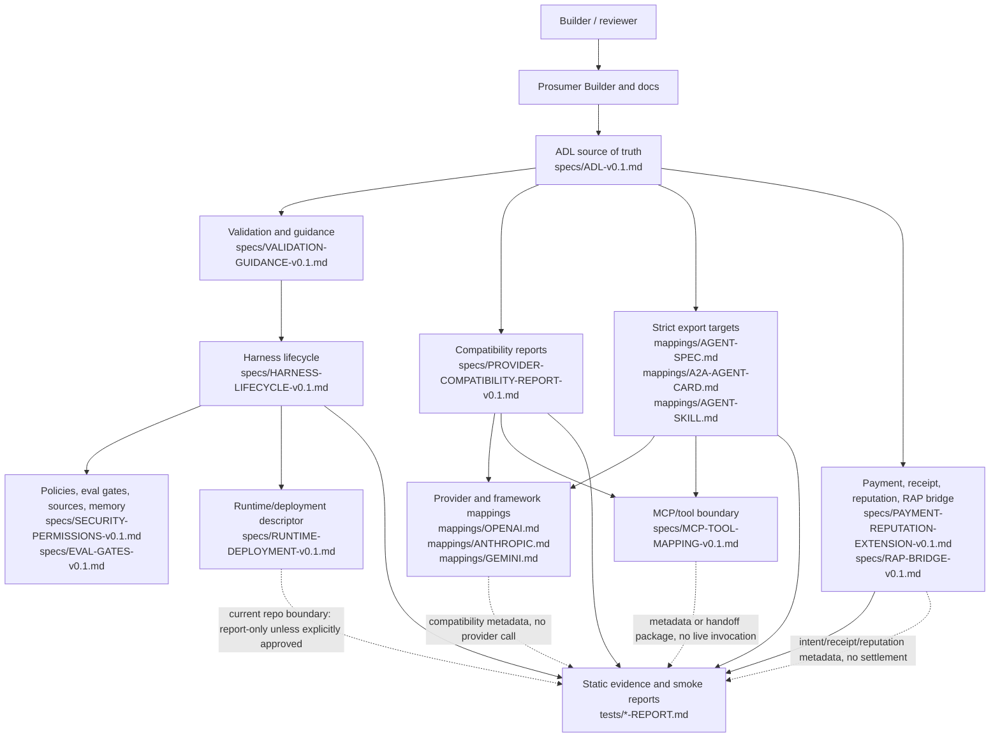

# ReddiAgent Architecture

_Issue: #208. Parent epic: #206._

ReddiAgent is a portable agent definition and harness review layer. Its center of gravity is ADL: a human-readable source of truth that describes model needs, harness behavior, policies, eval gates, runtime intent, and optional payment or reputation extensions before any live execution is allowed.

## System Diagram

## Architecture Narrative

### 1. Builder and Docs Surface

The builder-facing surface starts with `docs/REDDIAGENT-VISION-ROADMAP.md`, `docs/PROSUMER-MVP.md`, `docs/BUILDER-JOURNEY.md`, and the static Prosumer Builder export. These surfaces help a builder describe an agent, inspect readiness, and choose target reports without needing to read every spec first.

The docs layer is not an execution surface. It points readers toward local validation, dry-run evidence, compatibility reports, and explicit guardrails.

### 2. ADL as Source of Truth

`specs/ADL-v0.1.md` and `specs/ADL-v0.1.schema.json` are the canonical definition layer. ADL describes:

- model requirements and provider preferences;
- harness instructions, tools, functions, skills, data sources, memory, policies, eval gates, runtime, deployment, observability, and recovery;
- namespaced extensions for payment, receipts, reputation, identity, and future protocol bridges.

External formats are compatibility targets. If a target cannot preserve ReddiAgent semantics, the adapter must report the loss before export or execution.

### 3. Validation and Harness Boundary

Validation turns an ADL document into builder-facing feedback before runtime behavior begins. `specs/VALIDATION-GUIDANCE-v0.1.md` and the validation scripts handle required fields, schema failures, unknown extensions, source-boundary checks, memory requirements, and unsupported runtime features.

The harness lifecycle in `specs/HARNESS-LIFECYCLE-v0.1.md` describes the future execution sequence: load ADL, validate, resolve references, attach tools/data/memory, apply policies, start a trace, run the model/tool loop, evaluate gates, emit receipts or reputation signals, persist state, and shut down or await the next task.

In this repo, current automation keeps that boundary static/report-only unless a queued issue explicitly requires an approved live capability.

### 4. Compatibility Reports and Strict Exports

Compatibility reports answer "what would this ADL file mean for this target?" without calling providers or live runtimes. The provider compatibility layer covers OpenAI, Anthropic, Gemini, Ollama/local models, LangGraph, LlamaIndex, Strands, Vercel eve, and related targets through deterministic report scripts and fixtures.

Strict export targets are allowed only where ReddiAgent semantics can be preserved or explicitly marked as metadata-only/unsupported. Current export and mapping surfaces include:

- `mappings/AGENT-SPEC.md`;
- `mappings/A2A-AGENT-CARD.md`;
- `mappings/AGENT-SKILL.md`;
- `specs/MCP-RUNTIME-HANDOFF-PACKAGE.schema.json`;
- `specs/RAP-BRIDGE-v0.1.md`.

Silent loss of policy, source-boundary, memory, eval, MCP, payment, receipt, or reputation semantics is not acceptable.

### 5. MCP, Tool, Payment, and Reputation Boundaries

Tools and MCP servers are represented as reviewed declarations and handoff metadata before any invocation. MCP readiness evidence must keep `networkAccess=false`, `mcpInvocation=false`, and `paymentAccess=false` unless a later approved lane changes that boundary with tests and audit evidence.

Payment and reputation are extensions, not mandatory core dependencies. `specs/PAYMENT-REPUTATION-EXTENSION-v0.1.md`, `specs/X402-DRY-RUN-RECEIPT-v0.1.md`, and `specs/RAP-BRIDGE-v0.1.md` preserve payment intent, receipt shape, authority, and reputation metadata so RAP or another protocol layer can later own settlement and enforcement.

### 6. Evidence and Guardrails

Every major box in the diagram should leave deterministic evidence in docs, specs, tests, reports, or fixtures. Current static evidence is collected under `tests/*-REPORT.md`, `tests/smoke-validation.sh`, and focused unit tests.

Default guardrails for this docs lane:

- no live runtime activation;
- no provider/model API calls;
- no live MCP server resolution or invocation;
- no wallet, facilitator, payment rail, settlement, devnet, or mainnet activity;
- no credential lookup, secret storage, or deployment;
- no public docs publishing.

Mainnet deployment or runs remain explicitly unapproved.

## Canonical References

- `docs/REDDIAGENT-VISION-ROADMAP.md`
- `docs/ARCHITECTURE-THESIS.md`
- `specs/DOMAIN-MODEL-v0.1.md`
- `specs/ADL-v0.1.md`
- `specs/HARNESS-LIFECYCLE-v0.1.md`
- `specs/RUNTIME-DEPLOYMENT-v0.1.md`
- `specs/PROVIDER-COMPATIBILITY-REPORT-v0.1.md`
- `specs/MCP-TOOL-MAPPING-v0.1.md`
- `specs/PAYMENT-REPUTATION-EXTENSION-v0.1.md`
- `specs/RAP-BRIDGE-v0.1.md`
